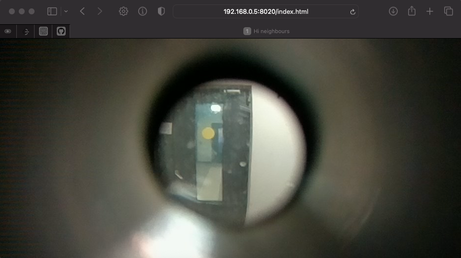
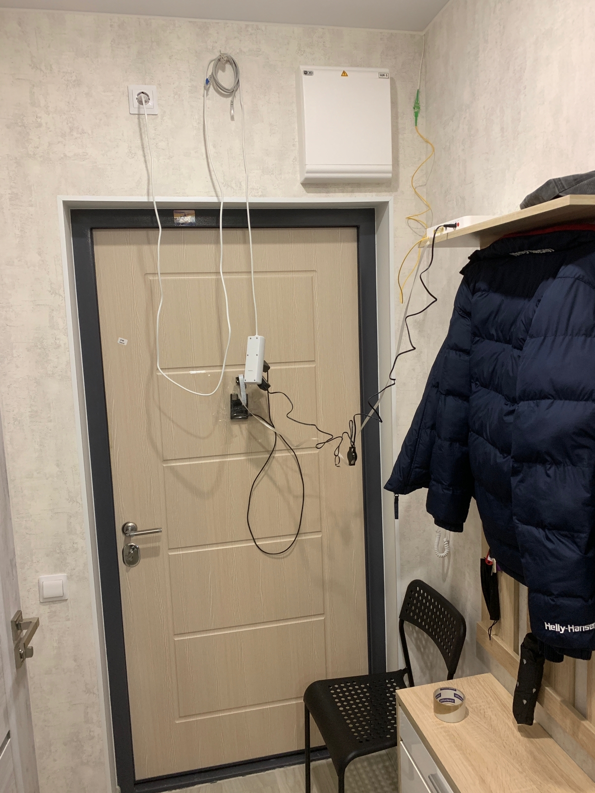
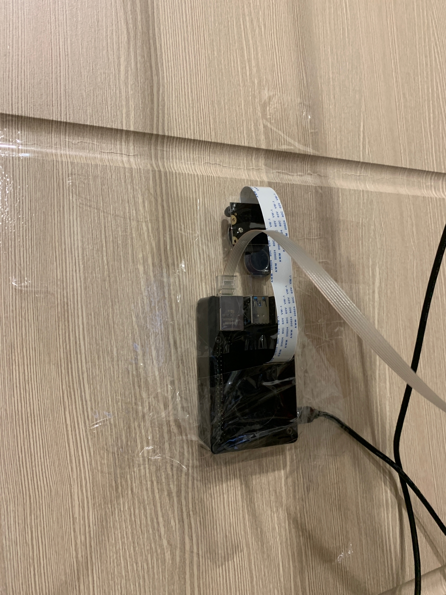

# doorbell-camera-pi
Progressive Open-Source SASS solution for small and large businesses.

Credits to: https://github.com/garyexplains

## Prerequisites:
- 1x RaspberryPi3/4 (or any other computer e.g. your old ass laptop)
- 1x Any camera (I use AOKIN)
- 1x Wifi male-male cable (but you can use Wifi it's up to you)

Actually the whole script and a web-server is nothing serious, also it does not require to install any side packages - pure Python only.
But depending on your configuration (hardware, software, wlan, etc) there might be some minor inconvenients. 

Enough talking let's working!

## Preparation:

You have to enable your camera in settings, so
1. ```sudo raspi-config```
2. **Interface Options -> Legacy Camera -> Enable**


Also enable VNC protocol in the same menu
1. ```sudo raspi-config```
2. **Interface Options -> VNC -> Enable**

Now you can check that your camera is connected and visible to pi:
```
vcgencmd get_camera
```
If everything is fine you should see something like that:
supported=1 detected=1, libcamera interfaces=0

Also, you may check, that your camera is actually taking pictures:
```
raspistill -o img1.jpg
```
The image will be stored in **/home/pi/**

You can download this picture via scp from your computer
```
scp pi@pi.local:/home/pi/img1.jpg .
```
Where **pi** - username, **pi.local** - raspberrypi ip address, **.** - your current dir


## Run the website:

```
python3 /home/pi/video-stream/main.py
```

You may pass these step, but if you want your website work after rebooting - don't miss it.
1. Add this line right to the bottom of the file /home/pi/.profile
```
sudo pkill -f "python3" #kill another python process 
sudo python3 /home/pi/video-stream/main.py #run the app/server
```
2. Just to be sure that our above code is working
```
sudo reboot now
```
3. You are done.

Now if you reboot or unplug your pi - it will restart the website by itself.

Few images of how it is working (Yes I know it's ugly as hell!).






